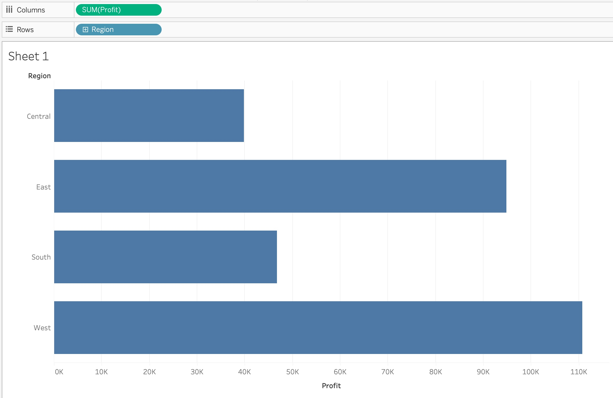
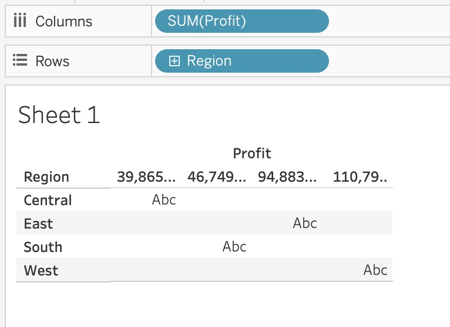
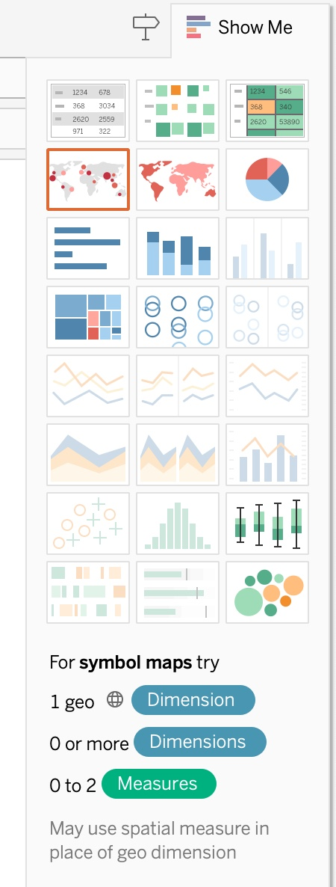
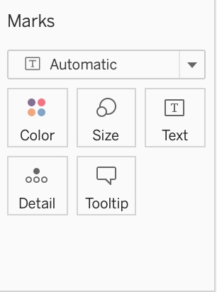
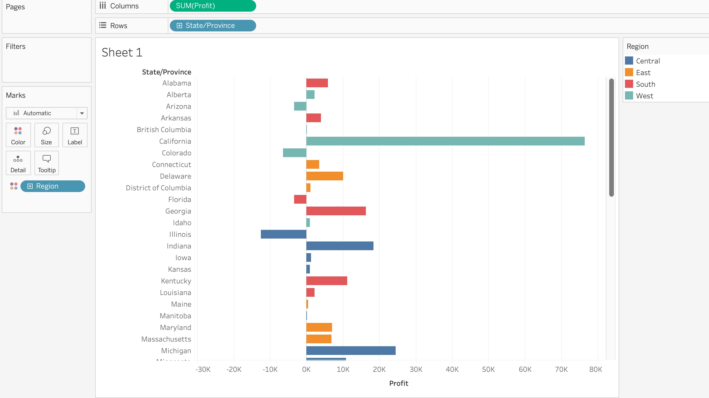

---
layout: post
title:  "Data Visualization in Tableau"
author: Trevor Bingham
description: This post will explain the basics of data visualization in Tableau.
image: "../assets/images/fog.png"
--- 

## Data Visualization

In the world today, data has become a very important factor for decision making in many industries. It can be difficult to communicate this data to a wide audience, especially when the data is complex and vast. This is where data visualization comes into play, facilitating the communication of data in meaningful and impactful ways, so that your audiecne can understand and interpert the data. In data visualization, there is a wide selection of different types of visualizations and even more tools to make these visualizations. In this blog, we will be focusing on one tool, Tableau, and why it is an excellent choice for data visualization. Tableau is a very powerful tool for data visualization, and has many amazing features that make visualizing your data so much more powerful, as well as being very intuitive and easy to use and learn. We will explore the basics of these features and how to use them to build amazing visualizations throughout this blog.

## Tableau Basics

To begin, in Tableau, it breaks the data up into two overarching categories when listing the variables, discrete or continuous. There are many different variable types, from strings, to date, and to numbers, but they are grouped into whether they are discrete or continuous. Discrete variables are colored blue, and continuous are colored green to easily separate the two. Whether a variable is being used as a discrete or continuous variable can have a large impact on what the visualization looks like. For example, using a sample data set of superstore information, we can make a simple bar chart looking at the profit of each region. In this case, the Profit metric is a continuous variable, and we can see what that looks like here:

Whereas changing the Profit metric to be a discrete variable chagnes the visualization to look like this:

In this simple example you can see the impact that being either discrete or continuous can have on the visualization in Tabluea. In general, for discrete measures, it will treat them similar to what you would expect of a categorical variable, and have a field for each potential value of the variable. For continuous measures, it will in general treat them as the values to visualize, such as the lengths of the bar charts in the image above. So as a general rule, if you want the measure to be the value visualized, make it a continuous measure, and use discrete measures for the groupings of those metrics. 

## Visualization Types

In Tableau, it will always try and guess at what type of visualization you would want based off of the measures and their types that you have selected to be visualized. In the bar chart above for example, selecting one discrete and one continuous measure to be visualized will default to a bar chart. Tableau offers many different types of visualizations though, and what the default brings up is not the only option. In the top right corner of Tableau, there is a button that says "Show Me" that if selected will show a list of all possible visualization options, and the requirements to use them. 

In this list, it shows us the many different visualization options that are available in Tableau, and what each one requires. In the image, the symbol map is highlighted, and it shows towards the bottom that in order to utilize that visualization, you need to have at least one geographical dimension selected, with some continuous measures being an option to add on to the graphic. Each visualization option will have what type of measures or dimensions it requires to be selected in order to be used, letting you easily know how you can create each visualization.

## Tableau Visualization Options

Tableau also offers a lot of other powerful tools to help enhance your visualizations. It lets you change the color of elements in the visualizations, it allows you to change the size of different elements, and it allows you to edit the text of the visualization, as well as letting you add more detail, and information to a tooltip when you hover over something. 

If you want to just edit what is already there without adding anything else, you can simply click on each icon, and it will show you what options are available for you to edit with what you have displayed. Or you can add new measures to add even more detail to the image by dragging that measure into what option you want it to impact. For example, using the same sample superstore data that Tableau gives you, you could make a bar chart of the profit of each state, and then color each bar by what region it is a part of, adding more information to the visualization without having to make it any more complex. 

## Conclusion

In this article, we barely scratched the surface of what all Tableau can do to facilitate making data visualizations and enhance them in simple ways. It is a powerful tool to use, and the way that it is set up makes it very easy to learn, and intuitive to use, making Tableau a great tool out of the many other options. 